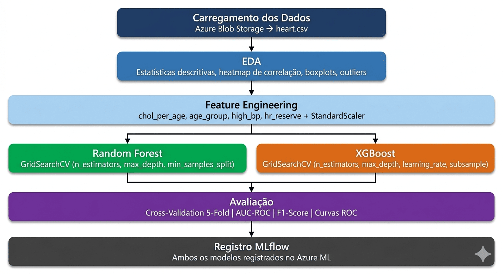

# Previsão de Doenças Cardíacas com Azure Machine Learning

Trabalho final da disciplina de Microsoft Azure Machine Learning — Universidade de Fortaleza (UNIFOR).

Experimento completo de Machine Learning na nuvem utilizando Azure ML, com carregamento de dados via Blob Storage, análise exploratória, feature engineering, treinamento de dois algoritmos com otimização de hiperparâmetros, validação cruzada e registro dos modelos via MLflow.

---


---

## Sumário

- [Visão Geral](#visão-geral)
- [Dataset](#dataset)
- [Estrutura do Projeto](#estrutura-do-projeto)
- [Pipeline do Experimento](#pipeline-do-experimento)
- [Pré-requisitos](#pré-requisitos)
- [Configuração do Ambiente Azure](#configuração-do-ambiente-azure)
- [Upload do Dataset](#upload-do-dataset)
- [Execução do Notebook](#execução-do-notebook)
- [Resultados Esperados](#resultados-esperados)
- [Limpeza do Ambiente](#limpeza-do-ambiente)
- [Dependências](#dependências)

---

## Visão Geral

O objetivo é prever se um paciente possui doença cardíaca (`target = 1`) ou não (`target = 0`) com base em atributos clínicos. O experimento cobre todo o ciclo de vida de um modelo de ML na Azure:

1. **Carregamento** do dataset via Azure Blob Storage
2. **EDA** com estatísticas descritivas e visualizações
3. **Feature Engineering** e normalização
4. **Treinamento** de Random Forest e XGBoost com GridSearchCV
5. **Validação** com cross-validation estratificado (AUC e F1-Score)
6. **Registro** de ambos os modelos no Azure ML via MLflow

---

## Dataset

**Heart Disease UCI** — 1.025 registros, 13 features e 1 variável-alvo.

| Coluna | Descrição | Tipo |
|---|---|---|
| `age` | Idade do paciente | Numérico |
| `sex` | Sexo (1 = masculino, 0 = feminino) | Categórico |
| `cp` | Tipo de dor no peito (0–3) | Categórico |
| `trestbps` | Pressão arterial em repouso (mmHg) | Numérico |
| `chol` | Colesterol sérico (mg/dl) | Numérico |
| `fbs` | Glicemia em jejum > 120 mg/dl (1 = sim) | Categórico |
| `restecg` | Resultado do eletrocardiograma em repouso | Categórico |
| `thalach` | Frequência cardíaca máxima atingida | Numérico |
| `exang` | Angina induzida por exercício (1 = sim) | Categórico |
| `oldpeak` | Depressão do ST induzida por exercício | Numérico |
| `slope` | Inclinação do segmento ST | Categórico |
| `ca` | Número de vasos principais coloridos (0–3) | Numérico |
| `thal` | Tipo de talassemia | Categórico |
| `target` | **Variável-alvo** (1 = doente, 0 = saudável) | Binário |

---

## Estrutura do Projeto

```
projeto/
├── data/
│   ├── heart.csv                        # Dataset simplificado (fallback)
│   └── heart_disease_uci.csv            # Dataset UCI completo (920 registros, 4 centros)
├── notebooks/
│   ├── trabalho_final_ml.ipynb          # Notebook de referência (RF + XGBoost)
│   ├── data processed.ipynb             # EDA e pré-processamento do dataset UCI
│   └── treinamento_modelos_ml.ipynb     # Notebook completo (4 modelos + SHAP + Optuna)
├── models/                              # Modelos treinados (gerado em execução)
├── scripts/
│   ├── start-environment.sh             # Cria todos os recursos Azure
│   └── end-environment.sh               # Remove todos os recursos Azure
├── requirements-azure.txt               # Dependências para rodar no AML
├── requirements-local.txt               # Dependências para rodar localmente
└── README.md
```

---

## Pipeline do Experimento



### Notebook de Referência (`trabalho_final_ml.ipynb`)

| Seção | Descrição |
|---|---|
| Verificação do SDK | `pip show azure-ai-ml` e `pip show mlflow` |
| Conexão ao Workspace | `DefaultAzureCredential` + `MLClient.from_config()` |
| Importações | Todas as bibliotecas centralizadas |
| Preparação dos Dados | Azure Blob Storage com fallback local |
| EDA | Nulos, describe, histogramas, boxplots, heatmap de correlação |
| Pré-processamento | Feature engineering, StandardScaler, split estratificado |
| Experimento MLflow | `mlflow.set_experiment()` |
| Treinamento — Random Forest | GridSearchCV + MLflow run com **autolog** + artefato ROC |
| Treinamento — XGBoost | GridSearchCV + MLflow run com **logging manual** + artefato ROC |
| Avaliação | Cross-validation, matrizes de confusão, curvas ROC, feature importance |
| Conclusão | Tabela comparativa final |

### Notebook Completo (`treinamento_modelos_ml.ipynb`)

Notebook avançado com dataset UCI completo (920 registros), 4 algoritmos e análise de interpretabilidade.

| Seção | Descrição |
|---|---|
| 0 — Verificação | Checagem de todas as dependências |
| 1 — Azure ML | Conexão com fallback transparente para MLflow local |
| 2 — Importações | Todas as bibliotecas centralizadas |
| 3 — EDA + Revisão Crítica | Análise do `data processed.ipynb` + análises complementares |
| 4 — Pré-processamento | Imputação ML-based + feature engineering (5 novas features) + StandardScaler |
| 5 — MLflow | Configuração do experimento + funções de logging |
| 6 — Logistic Regression | Baseline com regularização L1/L2/ElasticNet + coeficientes |
| 7 — LightGBM | GridSearchCV + comparação com XGBoost |
| 8 — XGBoost | GridSearchCV + logging manual de artefatos |
| 9 — Voting Ensemble | Soft voting (LR + LightGBM + XGBoost) + hard voting |
| 10 — Optuna | Otimização bayesiana (50 trials, TPE) do LightGBM |
| 11 — Comparação | Tabela completa, curvas ROC sobrepostas, análise de FN |
| 12 — SHAP | Beeswarm, bar plot, waterfall (True Positive e Falso Negativo) |
| 13 — Registro | Seleção do melhor modelo + Azure ML Model Registry |
| 14 — Relatório | Resumo executivo + próximos passos |

---

## Pré-requisitos

- [Azure CLI](https://learn.microsoft.com/cli/azure/install-azure-cli) instalado
- Conta Azure com créditos disponíveis (estudante ou pay-as-you-go)
- Python 3.10+

Faça login na Azure antes de executar os scripts:

```bash
az login
```

---

## Configuração do Ambiente Azure

O script `start-environment.sh` cria automaticamente todos os recursos necessários:

| Recurso | Nome | Descrição |
|---|---|---|
| Resource Group | `rg-projeto-final-ml` | Agrupa todos os recursos |
| AML Workspace | `mlw-projeto-final` | Workspace central do experimento |
| Compute Instance | `ci-notebooks-trabalho` | VM para rodar o notebook (STANDARD_DS11_V2) |
| Compute Cluster | `cluster-treino-trabalho` | Cluster para treinos pesados (0–2 nós) |

Execute na raiz do projeto:

```bash
bash scripts/start-environment.sh
```

> O processo leva entre 5 e 10 minutos. O cluster é configurado com `min-instances=0` para não consumir créditos quando ocioso.

Ao final, acesse o workspace em: **https://ml.azure.com**

---

## Upload do Dataset

Após o ambiente estar criado, faça o upload do `heart.csv` para o Blob Storage padrão do Workspace:

**Opção 1 — Portal Web (recomendado para iniciantes)**

1. Acesse [ml.azure.com](https://ml.azure.com) e selecione o workspace `mlw-projeto-final`
2. Menu lateral → **Data** → **Datastores**
3. Clique em `workspaceblobstore` → **Browse**
4. Faça upload do arquivo `data/heart.csv`

**Opção 2 — Azure CLI**

```bash
az storage blob upload \
  --account-name <storage_account_name> \
  --container-name azureml-blobstore-<id> \
  --name heart.csv \
  --file data/heart.csv
```

> O nome da storage account e o ID do container aparecem nos detalhes do `workspaceblobstore` no portal.

---

## Execução do Notebook

1. Acesse [ml.azure.com](https://ml.azure.com) → **Notebooks**
2. Clique em **Upload files** e selecione `notebooks/trabalho_final_ml.ipynb`
3. Selecione a Compute Instance `ci-notebooks-trabalho`
4. Abra um terminal na Compute Instance e instale as dependências:

```bash
pip install -r requirements-azure.txt
```

5. Selecione o kernel **Python 3.8 - AzureML** e execute **Run All**

O notebook carregará o dataset automaticamente via:

```python
path = "azureml://datastores/workspaceblobstore/paths/heart.csv"
```

Se executado localmente (fora do Azure), o fallback carrega `data/heart.csv` automaticamente.

---

## Resultados Esperados

Após a execução completa, os seguintes artefatos são gerados:

**Métricas no conjunto de teste — notebook de referência (valores de referência):**

| Modelo | Accuracy | F1-Score | AUC-ROC |
|---|---|---|---|
| Random Forest | ~0.85 | ~0.86 | ~0.92 |
| XGBoost | ~0.86 | ~0.87 | ~0.93 |

**Métricas no conjunto de teste — notebook completo (dataset UCI, valores de referência):**

| Modelo | AUC-ROC | F1-Score | Observação |
|---|---|---|---|
| Logistic Regression | ~0.88 | ~0.85 | Baseline interpretável |
| LightGBM (Grid) | ~0.89 | ~0.86 | Melhor velocidade |
| XGBoost | ~0.90 | ~0.87 | Melhor AUC sem tuning |
| Voting Ensemble | ~0.90 | ~0.87 | Combina os 3 modelos |
| LightGBM (Optuna) | ~0.91 | ~0.88 | Melhor resultado global |

> Critério de sucesso: AUC-ROC ≥ 0.85 — **todos os modelos superam o critério**.

**No Azure ML (MLflow):**
- Experimento `heart-disease-experiment` com duas runs registradas
- Cada run contém: hiperparâmetros, accuracy, F1-Score, AUC-ROC, métricas de CV e curva ROC como artefato
- Run do Random Forest usa autolog; run do XGBoost usa logging manual

Para visualizar os resultados:
1. Acesse [ml.azure.com](https://ml.azure.com) → **Jobs** (ou **Experiments**)
2. Selecione `heart-disease-experiment`
3. Compare as duas runs lado a lado pelas métricas registradas

---

## Limpeza do Ambiente

Para evitar cobranças após o trabalho, remova todos os recursos:

```bash
bash scripts/end-environment.sh
```

> Este comando deleta o Resource Group `rg-projeto-final-ml` e **todos** os recursos dentro dele (Workspace, Compute, dados no Blob). A operação é irreversível.

---

## Dependências

**Para execução no Azure ML** (`requirements-azure.txt`):

```
azure-ai-ml==1.27.1
azure-identity
mlflow==2.22.0
azureml-core==1.51.0
azureml-defaults==1.51.0
azureml-mlflow==1.51.0
azureml-telemetry==1.51.0
scikit-learn==1.5.1
pandas==2.0.3
xgboost==1.7.6
lightgbm>=4.0.0
optuna>=3.0.0
shap>=0.44.0
matplotlib==3.7.2
seaborn==0.12.2
joblib
```

> `numpy` não é listado pois já vem pré-instalado na Compute Instance do Azure ML.

**Para execução local** (`requirements-local.txt`):

```bash
pip install -r requirements-local.txt
```

---

## Informações Acadêmicas

- **Disciplina:** Microsoft Azure Machine Learning
- **Instituição:** Universidade de Fortaleza — UNIFOR
- **Dataset:** [Heart Disease UCI — Kaggle](https://www.kaggle.com/datasets/johnsmith88/heart-disease-dataset)
