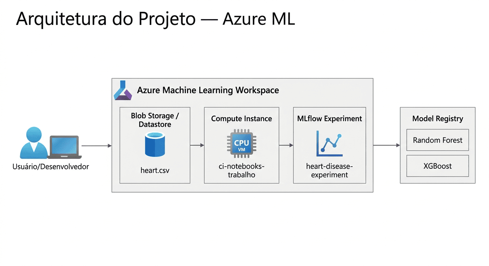

# 🫀 Heart Disease Prediction — Azure Machine Learning

[](https://www.python.org/downloads/)
[](https://azure.microsoft.com/services/machine-learning/)
[](https://mlflow.org/)
[](LICENSE)
[]()

> Projeto de Machine Learning para previsão de doenças cardíacas desenvolvido como trabalho final da disciplina de **Microsoft Azure Machine Learning** na Universidade de Fortaleza (UNIFOR). Combina quatro algoritmos de classificação, otimização bayesiana de hiperparâmetros, análise de interpretabilidade SHAP e registro de modelos via MLflow na nuvem Azure.

---

## 📋 Índice

- [Sobre o Projeto](#-sobre-o-projeto)
- [Características](#-características)
- [Arquitetura](#-arquitetura)
- [Datasets](#-datasets)
- [Instalação](#-instalação)
- [Uso](#-uso)
- [Notebooks](#-notebooks)
- [Resultados](#-resultados)
- [Estrutura do Projeto](#-estrutura-do-projeto)
- [Tecnologias](#-tecnologias)
- [Documentação](#-documentação)
- [Contribuição](#-contribuição)
- [Licença](#-licença)
- [Autores](#-autores)

---

## 🎯 Sobre o Projeto

Doenças cardiovasculares são a principal causa de morte no mundo, responsáveis por cerca de 17,9 milhões de vidas por ano (OMS). A detecção precoce é crucial para reduzir mortalidade e melhorar a qualidade de vida dos pacientes.

Este projeto implementa um pipeline completo de Machine Learning — desde a ingestão de dados até o registro de modelos em produção — utilizando a plataforma **Azure Machine Learning**. O objetivo é classificar pacientes como portadores ou não de doença cardíaca com base em 13 atributos clínicos, atingindo AUC-ROC ≥ 0.85.

**Problema:** Classificação binária (`target = 1` → doença cardíaca presente, `target = 0` → ausente).

**Contexto de aplicação:** Suporte à decisão clínica em triagem hospitalar.

---

## ✨ Características

### Modelos Implementados

| Modelo | Tipo | Papel |
|--------|------|-------|
| Logistic Regression | Linear | Baseline interpretável |
| LightGBM | Gradient Boosting | Alta performance, baixo custo |
| XGBoost | Gradient Boosting | Melhor AUC sem tuning |
| Voting Ensemble (Soft) | Ensemble | Combinação dos 3 modelos acima |

### Funcionalidades Principais

- **Pipeline end-to-end** no Azure ML com fallback local automático
- **Otimização bayesiana** de hiperparâmetros via Optuna (50 trials, TPE sampler)
- **Interpretabilidade** com SHAP (beeswarm, bar plot, waterfall por predição)
- **Rastreamento de experimentos** com MLflow (autolog + logging manual)
- **Feature engineering** com 5 novas variáveis derivadas
- **Imputação ML-based** para valores ausentes no dataset UCI
- **Registro e versionamento** de modelos no Azure ML Model Registry

### Métricas de Performance (dataset UCI, 920 registros)

| Modelo | AUC-ROC | F1-Score |
|--------|---------|---------|
| LightGBM + Optuna | ~0.91 | ~0.88 |
| XGBoost | ~0.90 | ~0.87 |
| Voting Ensemble | ~0.90 | ~0.87 |
| LightGBM (Grid) | ~0.89 | ~0.86 |
| Logistic Regression | ~0.88 | ~0.85 |

> Critério de sucesso: AUC-ROC ≥ 0.85 — **todos os modelos superam o critério**.

---

## 🏗️ Arquitetura



O projeto utiliza os seguintes componentes do Azure Machine Learning:

| Componente | Nome | Finalidade |
|------------|------|-----------|
| Resource Group | `rg-projeto-final-ml` | Agrupamento lógico dos recursos |
| AML Workspace | `mlw-projeto-final` | Hub central do experimento |
| Compute Instance | `ci-notebooks-trabalho` | VM para execução dos notebooks |
| Compute Cluster | `cluster-treino-trabalho` | Cluster para treinos distribuídos (0–2 nós) |
| Blob Storage | `workspaceblobstore` | Armazenamento dos datasets |
| Experiment | `heart-disease-experiment` | Rastreamento de runs e métricas |
| Model Registry | Azure ML Models | Versionamento de modelos treinados |

Para detalhes completos, consulte [docs/ARCHITECTURE.md](docs/ARCHITECTURE.md).

---

## 📊 Datasets

### heart.csv

- **Fonte:** [Heart Disease Dataset — Kaggle](https://www.kaggle.com/datasets/johnsmith88/heart-disease-dataset) (baseado no UCI Cleveland)
- **Registros:** 1.025 | **Features:** 13 | **Target:** `target` (0/1)
- **Distribuição:** ~51% positivos (doença presente) / ~49% negativos
- **Uso:** Notebook de referência (`trabalho_final_ml.ipynb`)

### heart_disease_uci.csv

- **Fonte:** [UCI Machine Learning Repository — Heart Disease](https://archive.ics.uci.edu/dataset/45/heart+disease)
- **Registros:** 920 | **Features:** 13 + `num` (0–4) | **Centros:** Cleveland, Hungary, Switzerland, VA Long Beach
- **Distribuição:** ~45% negativos (num=0) / ~55% positivos (num≥1, binarizado)
- **Uso:** Notebook avançado (`treinamento_modelos_ml.ipynb`)

Para o dicionário completo de dados, consulte [docs/DATA_DICTIONARY.md](docs/DATA_DICTIONARY.md).

---

## 🚀 Instalação

### Pré-requisitos

- Python 3.10+
- [Azure CLI](https://learn.microsoft.com/cli/azure/install-azure-cli) instalado
- Conta Azure com créditos disponíveis (estudante ou pay-as-you-go)
- Git

### 1. Clonar o Repositório

```bash
git clone <url-do-repositorio>
cd projeto
```

### 2. Instalar Dependências

**Ambiente local:**
```bash
pip install -r requirements-local.txt
```

**Ambiente Azure ML:**
```bash
pip install -r requirements-azure.txt
```

### 3. Configurar o Ambiente Azure

Faça login na Azure:
```bash
az login
```

Execute o script de inicialização (cria todos os recursos necessários):
```bash
bash scripts/start-environment.sh
```

> O processo leva entre 5 e 10 minutos. O cluster é configurado com `min-instances=0` para não consumir créditos quando ocioso.

Para guia detalhado de configuração, consulte [docs/SETUP.md](docs/SETUP.md).

---

## 📖 Uso

### Fluxo de Execução Recomendado

1. **Configurar ambiente** — execute `bash scripts/start-environment.sh`
2. **Upload do dataset** — faça upload de `data/heart.csv` para o `workspaceblobstore`
3. **Explorar os dados** — abra `notebooks/data processed.ipynb`
4. **Treinar os modelos** — abra `notebooks/treinamento_modelos_ml.ipynb` e execute todas as células
5. **Comparar resultados** — acesse o experimento no portal ml.azure.com
6. **Limpar recursos** — execute `bash scripts/end-environment.sh`

### Upload do Dataset (Opção Portal Web)

1. Acesse [ml.azure.com](https://ml.azure.com) e selecione `mlw-projeto-final`
2. Menu lateral → **Data** → **Datastores** → `workspaceblobstore` → **Browse**
3. Faça upload de `data/heart.csv`

### Upload do Dataset (Azure CLI)

```bash
az storage blob upload \
  --account-name <storage_account_name> \
  --container-name azureml-blobstore-<id> \
  --name heart.csv \
  --file data/heart.csv
```

### Execução no Azure ML

1. Acesse [ml.azure.com](https://ml.azure.com) → **Notebooks**
2. Clique em **Upload files** e selecione o notebook desejado
3. Selecione a Compute Instance `ci-notebooks-trabalho`
4. Abra terminal na Compute Instance e instale dependências:
   ```bash
   pip install -r requirements-azure.txt
   ```
5. Selecione kernel **Python 3.10** e execute **Run All**

### Limpeza do Ambiente

```bash
bash scripts/end-environment.sh
```

> **Atenção:** Este comando deleta o Resource Group e **todos** os recursos dentro dele. A operação é irreversível.

---

## 📓 Notebooks

### `data processed.ipynb` — Exploração e Pré-processamento

Análise exploratória do dataset UCI completo com:
- Estatísticas descritivas e distribuição das variáveis
- Análise de valores ausentes e estratégia de imputação
- Visualizações: histogramas, boxplots, heatmap de correlação
- Encoding de variáveis categóricas
- Preparação do dataset para treinamento

### `trabalho_final_ml.ipynb` — Notebook de Referência

Pipeline completo com Random Forest e XGBoost:
- Conexão ao Azure ML Workspace via `DefaultAzureCredential`
- Carregamento do dataset via Blob Storage com fallback local
- Treinamento com GridSearchCV e validação cruzada estratificada
- Logging via MLflow (autolog no RF, manual no XGBoost)
- Comparação final com curvas ROC e matrizes de confusão

### `treinamento_modelos_ml.ipynb` — Notebook Avançado (Principal)

Pipeline completo de nível produção com 4 algoritmos:
- Dataset UCI (920 registros, 4 centros clínicos)
- Feature engineering com 5 variáveis derivadas
- Otimização bayesiana com Optuna (50 trials)
- Análise SHAP para interpretabilidade
- Registro do melhor modelo no Azure ML Model Registry

Para documentação detalhada de cada notebook, consulte [docs/PIPELINE.md](docs/PIPELINE.md).

---

## 📈 Resultados

### Notebook de Referência (heart.csv — 1.025 registros)

| Modelo | Accuracy | F1-Score | AUC-ROC |
|--------|----------|---------|---------|
| Random Forest | ~0.85 | ~0.86 | ~0.92 |
| XGBoost | ~0.86 | ~0.87 | ~0.93 |

### Notebook Avançado (UCI — 920 registros)

| Modelo | AUC-ROC | F1-Score | Observação |
|--------|---------|---------|------------|
| LightGBM + Optuna | ~0.91 | ~0.88 | **Melhor resultado** |
| XGBoost | ~0.90 | ~0.87 | Melhor sem tuning |
| Voting Ensemble | ~0.90 | ~0.87 | Robustez combinada |
| LightGBM (Grid) | ~0.89 | ~0.86 | Alta velocidade |
| Logistic Regression | ~0.88 | ~0.85 | Baseline interpretável |

### Principais Insights (SHAP)

- `thal` (tipo de talassemia) e `cp` (tipo de dor no peito) são os preditores mais relevantes
- `ca` (vasos principais coloridos) tem forte correlação negativa com a presença de doença
- `thalach` (frequência cardíaca máxima) apresenta relação positiva com saúde cardíaca
- Falsos negativos concentram-se em pacientes com `thal=reversable defect` e `cp=asymptomatic`

Para análise completa, consulte [docs/MODELS.md](docs/MODELS.md).

---

## 📁 Estrutura do Projeto

```
projeto/
├── data/
│   ├── heart.csv                        # Dataset simplificado (1.025 registros)
│   └── heart_disease_uci.csv            # Dataset UCI completo (920 registros, 4 centros)
├── docs/
│   ├── arquitetura_azure.png            # Diagrama da arquitetura no Azure
│   ├── pipeline_ml.png                  # Diagrama do pipeline de ML
│   ├── ARCHITECTURE.md                  # Documentação detalhada da arquitetura
│   ├── DATA_DICTIONARY.md               # Dicionário de dados dos datasets
│   ├── MODELS.md                        # Documentação técnica dos modelos
│   ├── PIPELINE.md                      # Documentação do pipeline de ML
│   ├── SETUP.md                         # Guia detalhado de configuração
│   └── CHANGELOG.md                     # Histórico de versões
├── notebooks/
│   ├── data processed.ipynb             # EDA e pré-processamento
│   ├── trabalho_final_ml.ipynb          # Notebook de referência (RF + XGBoost)
│   └── treinamento_modelos_ml.ipynb     # Notebook avançado (4 modelos + SHAP + Optuna)
├── scripts/
│   ├── start-environment.sh             # Cria todos os recursos Azure
│   └── end-environment.sh               # Remove todos os recursos Azure
├── CONTRIBUTING.md                      # Guia de contribuição
├── LICENSE                              # Licença MIT
├── README.md                            # Este arquivo
├── requirements-azure.txt               # Dependências para Azure ML
└── requirements-local.txt               # Dependências para execução local
```

---

## 🛠️ Tecnologias

| Categoria | Tecnologia | Versão |
|-----------|-----------|--------|
| Plataforma Cloud | Azure Machine Learning | 1.27.x |
| Rastreamento | MLflow | 2.22.0 |
| ML — Boosting | XGBoost | 1.7.6 |
| ML — Boosting | LightGBM | ≥ 4.0.0 |
| ML — Framework | scikit-learn | 1.5.1 |
| Otimização | Optuna | ≥ 3.0.0 |
| Interpretabilidade | SHAP | ≥ 0.44.0 |
| Dados | pandas | 2.0.3 |
| Dados | numpy | (pré-instalado no AML) |
| Visualização | matplotlib | 3.7.2 |
| Visualização | seaborn | 0.12.2 |
| Linguagem | Python | 3.10+ |

---

## 📚 Documentação

| Documento | Descrição |
|-----------|-----------|
| [ARCHITECTURE.md](docs/ARCHITECTURE.md) | Arquitetura Azure ML e decisões de design |
| [DATA_DICTIONARY.md](docs/DATA_DICTIONARY.md) | Dicionário completo dos datasets |
| [MODELS.md](docs/MODELS.md) | Documentação técnica dos modelos |
| [PIPELINE.md](docs/PIPELINE.md) | Etapas do pipeline de ML |
| [SETUP.md](docs/SETUP.md) | Guia detalhado de configuração do ambiente |
| [CHANGELOG.md](docs/CHANGELOG.md) | Histórico de versões |
| [CONTRIBUTING.md](CONTRIBUTING.md) | Como contribuir com o projeto |

---

## 🤝 Contribuição

Contribuições são bem-vindas! Consulte [CONTRIBUTING.md](CONTRIBUTING.md) para diretrizes de código, padrões de commit e como submeter pull requests.

---

## 📄 Licença

Este projeto está licenciado sob a **MIT License** — veja o arquivo [LICENSE](LICENSE) para detalhes.

---

## 👨‍💻 Autores

**Emerson da Silva Maciel**
- GitHub: [@Oemersonmaciel](https://github.com/Oemersonmaciel)
- E-mail: emerson.maciel22@gmail.com
- Instituição: Universidade de Fortaleza — UNIFOR

**Rommel Assunção de Oliveira Sousa**
- GitHub: [@JLR5420RS](https://github.com/JLR5420RS)
- E-mail: rommel.mod@gmail.com
- Instituição: Universidade de Fortaleza — UNIFOR

**Wagner Costa Oliveira**
- GitHub: [@wagnercoliveira](https://github.com/wagnercoliveira)
- E-mail: wagner.costa.oliveira@gmail.com
- Instituição: Universidade de Fortaleza — UNIFOR

---

## 🙏 Agradecimentos

- **UCI Machine Learning Repository** pela disponibilização pública do dataset
- **Professor Marcondes Alexandre da disciplina de Azure ML — UNIFOR** pela orientação acadêmica
- **Microsoft Azure** pelo programa de créditos educacionais

---

*Última atualização: Maio 2026*
